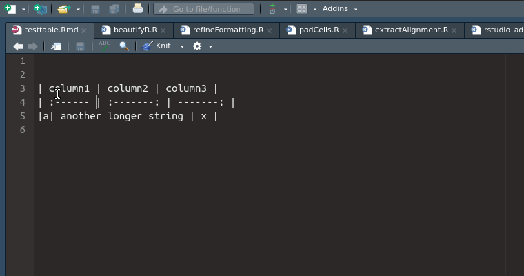

# beautifyR
RStudio addin for formatting Rmarkdown tables

## Features
- Formatting column content flushleft, flushright and centering accordingly

### In Progress
- (inserting missing formatting row)
- (inserting missing columns)
