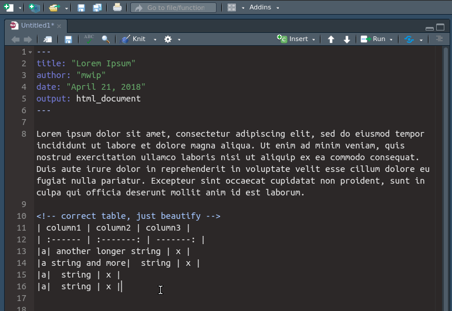
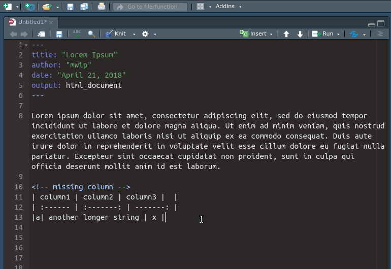
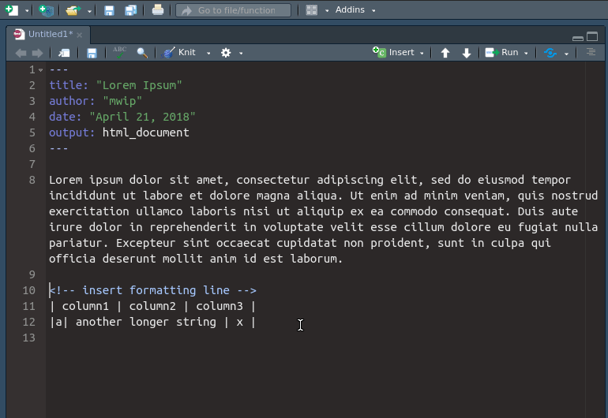

# beautifyR
## RStudio addin for formatting Rmarkdown tables

---

beautifyR is a RStudio addin that helps you formatting Markdown tables. It 
aligns the columns according to the content width, adds missing columns if 
needed and inserts the formatting row if missing. 

Feel free to install it from my Github via `devtools::install_github('mwip/beautifyR')`. 

If you encounter any bugs, please report them as an [issue](https://github.com/mwip/beautifyR/issues)

---

## beautifyR in action
### beautify

### Insert and fill missing columns

### Insert missing formatting 

