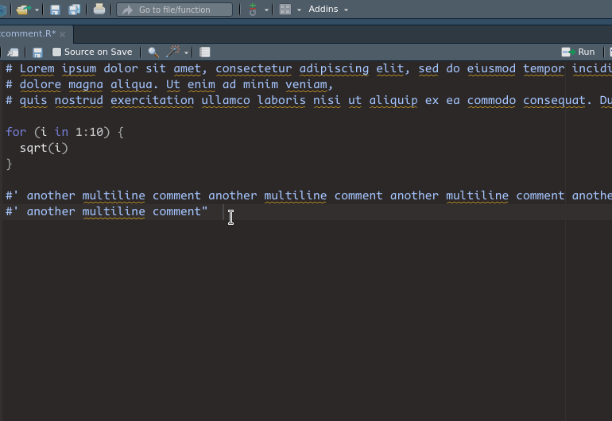

# beautifyR
## RStudio addin for formatting Rmarkdown tables and R multi-line comments

---

beautifyR is a RStudio addin that helps you formatting Markdown tables. It 
aligns the columns according to the content width, adds missing columns if 
needed and inserts the formatting row if missing. 

Additionally the Beautify Comment addin allows for aligning multi-line comments.
This saves a lot of time when editing vast commentary in code.

Feel free to install it from my Github via the 
[adddinslist](https://github.com/daattali/addinslist) or use 
`devtools::install_github('mwip/beautifyR')`. 

If you encounter any bugs, please report them as an 
[issue](https://github.com/mwip/beautifyR/issues).

---

## beautifyR in action
### Beautify multi-line comments in R code

### Beautify Table

### Insert and fill missing columns

### Insert missing formatting 

*GIFs generated with [Peek](https://github.com/phw/peek).* 
